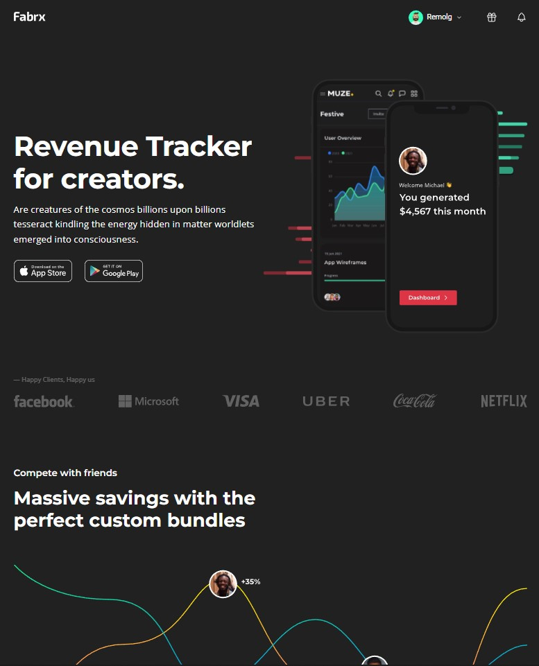

# Teknoloji Web Sitesi 2

Bu proje CSS öğrenirken boş zamanımda yaptığım bir diğer bir Teknoloji Web Sitesi projesidir


## Öğrendiklerim

Divleri daha doğru kullanmayı düzgün isimlendirmeyi öğrendim

Bu projede olabildiğince semantik kod kullandım 


  
## Bilgisayarınızda Çalıştırın

Projeyi klonlayın

```bash
  git clone https://github.com/remolg/Technology-Website-Two.git
```

Proje dizinine gidin

```bash
  cd "Technology-Website-Two"
```


  
## Ekran Görüntüleri




  